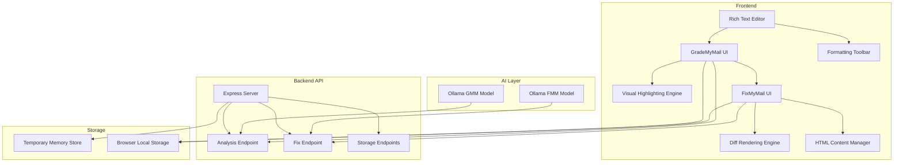

# Design Document

## Overview

The Email Analysis System is a two-stage web application that analyzes and improves email content through AI-powered text processing with rich text editing capabilities. The system consists of:

1. **GradeMyMail**: A rich text editor with real-time analysis engine that identifies and visually highlights email issues
2. **FixMyMail**: An improvement tool that generates better alternatives for problematic content while preserving formatting
3. **Rich Text Engine**: Advanced WYSIWYG editor with formatting toolbar and HTML content management
4. **Backend API**: Express.js server handling AI model communication and temporary data storage
5. **AI Models**: Two specialized models (GMM for analysis, FMM for improvements) running on Ollama

The architecture follows a client-server pattern with rich text editing capabilities, real-time visual feedback, and seamless data flow between analysis and improvement phases while maintaining HTML formatting throughout the process.

## Architecture

### System Components



### Data Flow Architecture

#### Analysis Phase (Real-time Processing Pipeline)

```
User Rich Text Input
  ↓ (debounced 1s)
Content Sanitization & Validation
  ↓
State Management (Zustand Store)
  ↓
API Request (React Query with retry logic)
  ↓
Express.js Middleware Chain
  ↓
Request Validation & Rate Limiting
  ↓
Ollama GMM Model (Port 11434)
  ↓
AI Response Processing & Parsing
  ↓
Tagged Content Response
  ↓
Client-side Highlighting Engine
  ↓
Canvas/SVG Overlay Rendering
  ↓
Smooth Animation Pipeline (60fps)
```

#### Transition Phase (Seamless State Transfer)

```
Analysis Complete Event
  ↓
Data Serialization (HTML + Plain Text + Tags)
  ↓
Parallel Storage Strategy:
  ├── Local Storage (Primary)
  ├── Session Storage (Backup)
  └── Server Temp Store (UUID-based)
  ↓
Route Navigation (React Router)
  ↓
Loading State Management
  ↓
Data Hydration in FixMyMail
```

#### Improvement Phase (Optimized Diff Generation)

```
Tagged Content Extraction
  ↓
Sentence Parsing & Validation
  ↓
Batch API Request Optimization
  ↓
Express.js Processing Pipeline
  ↓
Ollama FMM Model (Port 11435)
  ↓
Structured Response Parsing
  ↓
Content Reconstruction Algorithm
  ↓
Virtual Diff Rendering
  ↓
Interactive Hover Synchronization
  ↓
Performance Monitoring & Cleanup
```

#### Error Handling Flow

```
Error Detection
  ↓
Error Classification (Network/Validation/AI/Client)
  ↓
Retry Logic (Exponential Backoff)
  ↓
Fallback Strategies
  ↓
User-Friendly Error Display
  ↓
Recovery Action Suggestions
```

## Advanced Features Architecture

### Template System

- **Template Engine**: Dynamic template rendering with placeholder replacement
- **Category Management**: Organized templates by business type and use case
- **Smart Suggestions**: AI-powered template recommendations based on content analysis
- **Custom Templates**: User-created templates with sharing capabilities
- **Template Analytics**: Usage tracking and performance metrics

### Collaboration Platform

- **Real-time Editing**: WebSocket-based concurrent editing with operational transforms
- **Comment System**: Contextual comments with threading and resolution tracking
- **Version Control**: Git-like versioning with branching and merging capabilities
- **Share Management**: Granular permissions with expiration and access controls
- **Activity Feed**: Real-time notifications and collaboration history

### Analytics Dashboard

- **Writing Insights**: Personal improvement tracking and trend analysis
- **Performance Metrics**: Email effectiveness scoring and benchmarking
- **Achievement System**: Gamified progress tracking with badges and milestones
- **Recommendation Engine**: Personalized writing tips based on usage patterns
- **Export Reports**: Comprehensive analytics export in multiple formats

### Integration Hub

- **Email Client APIs**: Direct integration with Gmail, Outlook, Apple Mail
- **Marketing Platforms**: Export compatibility with Mailchimp, Constant Contact, HubSpot
- **CRM Integration**: Salesforce, Pipedrive, and other CRM platform connections
- **Webhook Support**: Custom integrations with third-party applications
- **API Gateway**: RESTful API for external application integration

### Offline Capabilities

- **Service Worker**: Advanced caching strategies for offline functionality
- **Local AI Models**: Lightweight models for basic analysis without internet
- **Sync Engine**: Intelligent conflict resolution and data synchronization
- **Progressive Web App**: Native app-like experience with offline support
- **Background Sync**: Queue operations for execution when connectivity returns

## Components and Interfaces

### Frontend Components

#### Rich Text Editor (Industry Standard)

- **Editor Engine**: Quill.js or TinyMCE for professional WYSIWYG editing
- **Toolbar Components**: Modular formatting controls (bold, italic, lists, links, images)
- **Content Sanitization**: DOMPurify for XSS protection
- **Undo/Redo System**: Command pattern implementation with history stack
- **Keyboard Shortcuts**: Standard shortcuts (Ctrl+B, Ctrl+I, etc.)
- **Auto-save**: Debounced local storage persistence
- **Paste Handler**: Smart formatting preservation and cleanup

#### GradeMyMail Interface (Modern React/Vue Architecture)

- **EditorContainer**: Wrapper component managing rich text editor state
- **HighlightOverlay**: Canvas-based or SVG highlighting for smooth performance
- **AnalysisEngine**: RxJS-based reactive analysis pipeline
- **LegendComponent**: Animated legend with smooth transitions
- **ActionButton**: Material Design or Tailwind-styled CTA button
- **LoadingSpinner**: Skeleton loading states and progress indicators

#### FixMyMail Interface (Performance Optimized)

- **VirtualizedDiff**: React-window or similar for large content rendering
- **SplitPaneLayout**: Resizable panels with smooth drag interactions
- **DiffHighlighter**: Optimized text comparison with minimal DOM manipulation
- **HoverEffects**: CSS transforms and GPU acceleration
- **LazyRenderer**: Progressive content loading for large emails

#### Shared Infrastructure (Enterprise Grade)

- **StateManager**: Redux Toolkit or Zustand for predictable state management
- **APILayer**: Axios with interceptors, retry logic, and request cancellation
- **ErrorBoundary**: React error boundaries with fallback UI
- **ThemeProvider**: CSS-in-JS or CSS custom properties for theming
- **AccessibilityManager**: ARIA labels, keyboard navigation, screen reader support
- **PerformanceMonitor**: Web Vitals tracking and performance metrics

### Backend API Endpoints

#### Analysis Endpoint (`POST /api/analyze`)

```javascript
Request: {
  message: string; // Raw email content
}

Response: {
  message: {
    content: string; // Tagged content with XML-style markers
  }
}
```

#### Fix Endpoint (`POST /api/fix`)

```javascript
Request: {
  message: string; // Tagged sentences only
}

Response: {
  message: {
    content: string; // Improved pairs in old_draft/optimized_draft format
  }
}
```

#### Storage Endpoints

- `POST /api/store`: Store temporary data, return UUID
- `GET /api/load?id=UUID`: Retrieve stored data

### AI Model Integration

#### GMM (GradeMyMail Model)

- **Purpose**: Analyze email content and identify issues
- **Input**: Raw email text
- **Output**: Same text with XML tags around problematic areas
- **Tags**: `<fluff>`, `<spam_words>`, `<hard_to_read>`
- **Port**: 11434

#### FMM (FixMyMail Model)

- **Purpose**: Generate improved alternatives for tagged content
- **Input**: Tagged sentences extracted from GMM output
- **Output**: Paired improvements in structured format
- **Format**: `<old_draft>original</old_draft><optimized_draft>improved</optimized_draft>`
- **Port**: 11435

## Data Models

### Email Content Model

```javascript
{
  id: string,                  // Unique identifier for the email
  originalText: string,        // Plain text input
  originalHTML: string,        // Rich HTML representation
  taggedContent: string,       // GMM output with XML tags
  analyzedSentences: Array<{   // Parsed issue data
    type: 'fluff' | 'spam_words' | 'hard_to_read',
    sentence: string,
    position: { start: number, end: number },
    severity: 'low' | 'medium' | 'high'
  }>,
  metadata: {
    emailType: 'business' | 'marketing' | 'personal' | 'follow-up',
    tone: 'professional' | 'casual' | 'urgent' | 'friendly',
    readabilityScore: number,   // Flesch-Kincaid level
    engagementScore: number,    // Overall engagement rating
    wordCount: number,
    estimatedReadTime: number,
    createdAt: Date,
    lastModified: Date,
    version: number
  }
}
```

### Improvement Model

```javascript
{
  improvements: Array<{
    original: string,          // Original problematic text
    improved: string,          // AI-generated improvement
    type: string,             // Issue type that was addressed
    confidence: number,       // AI confidence score (0-1)
    reasoning: string         // Explanation of the improvement
  }>,
  fullImprovedText: string,   // Complete reconstructed content
  diffData: Array<{          // Line-by-line comparison data
    type: 'added' | 'removed' | 'unchanged',
    content: string,
    lineNumber: number
  }>,
  analytics: {
    overallImprovement: number,  // Percentage improvement score
    readabilityGain: number,     // Readability score improvement
    engagementGain: number,      // Engagement score improvement
    toneConsistency: number      // Tone consistency score
  }
}
```

### Template Model

```javascript
{
  id: string,
  name: string,
  category: 'business' | 'marketing' | 'personal' | 'follow-up',
  description: string,
  content: {
    subject: string,
    body: string,           // Rich HTML content
    placeholders: Array<{   // Dynamic content areas
      key: string,
      label: string,
      type: 'text' | 'email' | 'date' | 'number',
      required: boolean,
      defaultValue?: string
    }>
  },
  metadata: {
    usage: number,          // How many times used
    rating: number,         // User rating (1-5)
    tags: string[],
    createdBy: string,
    isPublic: boolean,
    lastUsed: Date
  }
}
```

### Collaboration Model

```javascript
{
  emailId: string,
  collaborators: Array<{
    userId: string,
    name: string,
    email: string,
    role: 'owner' | 'editor' | 'viewer',
    joinedAt: Date,
    lastActive: Date
  }>,
  comments: Array<{
    id: string,
    userId: string,
    content: string,
    position: { start: number, end: number },
    resolved: boolean,
    createdAt: Date,
    replies: Array<{
      userId: string,
      content: string,
      createdAt: Date
    }>
  }>,
  versions: Array<{
    id: string,
    content: string,
    userId: string,
    timestamp: Date,
    changes: string,        // Summary of changes
    isAutoSave: boolean
  }>,
  shareSettings: {
    linkId: string,
    expiresAt?: Date,
    passwordProtected: boolean,
    allowComments: boolean,
    allowEditing: boolean
  }
}
```

### Analytics Model

```javascript
{
  userId: string,
  timeframe: 'week' | 'month' | 'quarter' | 'year',
  metrics: {
    emailsAnalyzed: number,
    averageReadabilityScore: number,
    averageEngagementScore: number,
    commonIssues: Array<{
      type: string,
      frequency: number,
      trend: 'improving' | 'stable' | 'declining'
    }>,
    writingProgress: Array<{
      date: Date,
      readabilityScore: number,
      engagementScore: number,
      issueCount: number
    }>,
    achievements: Array<{
      id: string,
      name: string,
      description: string,
      unlockedAt: Date,
      category: 'improvement' | 'consistency' | 'engagement'
    }>
  },
  insights: Array<{
    type: 'tip' | 'pattern' | 'achievement',
    title: string,
    description: string,
    actionable: boolean,
    priority: 'low' | 'medium' | 'high'
  }>
}
```

### Storage Model

```javascript
{
  id: string,                 // UUID for temporary storage
  payload: {
    fullOriginalText: string,
    fullOriginalHTML: string,
    taggedContent: string
  },
  created: number,            // Timestamp for TTL cleanup
  expires: number             // Auto-cleanup after 30 minutes
}
```

## Error Handling

### Client-Side Error Handling

- **Network Failures**: Retry mechanism with exponential backoff
- **Invalid Responses**: Graceful degradation with user-friendly messages
- **Storage Failures**: Fallback between localStorage and sessionStorage
- **Navigation Errors**: Breadcrumb navigation and return-to-previous options

### Server-Side Error Handling

- **AI Model Unavailable**: Clear error messages with retry suggestions
- **Invalid Requests**: Input validation with specific error details
- **Storage Failures**: Automatic cleanup and memory management
- **Rate Limiting**: Request throttling to prevent abuse

### Error Recovery Strategies

1. **Automatic Retry**: For transient network issues
2. **Graceful Degradation**: Show partial results when possible
3. **User Guidance**: Clear instructions for manual recovery
4. **State Preservation**: Maintain user input during error conditions

## Testing Strategy

### Unit Testing

- **Frontend Components**: Jest with DOM testing utilities
- **API Endpoints**: Supertest for HTTP request/response testing
- **Utility Functions**: Pure function testing with edge cases
- **Storage Operations**: Mock storage with various failure scenarios

### Integration Testing

- **End-to-End Workflow**: Cypress tests covering full user journey
- **AI Model Integration**: Mock AI responses for consistent testing
- **Cross-Browser Compatibility**: Automated testing on major browsers
- **Mobile Responsiveness**: Touch interaction and viewport testing

### Performance Testing

- **Load Testing**: Concurrent user simulation
- **Memory Usage**: Monitoring for memory leaks in long sessions
- **Response Times**: API endpoint performance benchmarking
- **Visual Performance**: Highlight animation smoothness testing

### Security Testing

- **Input Sanitization**: XSS prevention and HTML injection testing
- **Data Validation**: Malformed request handling
- **Storage Security**: Sensitive data exposure prevention
- **Rate Limiting**: API abuse prevention testing

## Modern UI/UX Design Principles

### Design System

- **Component Library**: Headless UI components with consistent styling
- **Design Tokens**: Centralized color palette, typography, spacing system
- **Responsive Design**: Mobile-first approach with fluid layouts
- **Dark/Light Mode**: System preference detection with manual toggle
- **Micro-interactions**: Subtle animations for user feedback
- **Loading States**: Skeleton screens, progress indicators, and smooth transitions

### User Experience Patterns

- **Progressive Disclosure**: Show complexity gradually as needed
- **Contextual Help**: Inline tooltips and guided onboarding
- **Keyboard Navigation**: Full accessibility with tab order and shortcuts
- **Error Prevention**: Real-time validation and helpful error messages
- **Undo/Redo**: Command pattern for all user actions
- **Auto-save**: Continuous background saving with visual indicators

### Performance-First Architecture

- **Code Splitting**: Route-based and component-based lazy loading
- **Tree Shaking**: Eliminate unused code from bundles
- **Critical CSS**: Inline above-the-fold styles for faster rendering
- **Service Workers**: Offline functionality and background sync
- **Web Workers**: Heavy computations off the main thread
- **Virtual Scrolling**: Handle large content without performance degradation

## Technology Stack (Industry Standard)

### Frontend Framework

- **React 18+**: Latest features including Concurrent Rendering and Suspense
- **TypeScript**: Full type safety and better developer experience
- **Vite**: Lightning-fast build tool with HMR
- **Tailwind CSS**: Utility-first CSS framework for rapid development
- **Framer Motion**: Production-ready motion library for animations

### State Management

- **Zustand**: Lightweight state management with TypeScript support
- **React Query**: Server state management with caching and synchronization
- **Immer**: Immutable state updates with mutable syntax

### Rich Text Editor

- **Lexical**: Facebook's extensible text editor framework
- **Alternative**: Tiptap (ProseMirror-based) for advanced customization
- **DOMPurify**: HTML sanitization for security

### Development Tools

- **ESLint + Prettier**: Code quality and formatting
- **Husky**: Git hooks for pre-commit validation
- **Storybook**: Component development and documentation
- **Chromatic**: Visual regression testing

### Backend Modernization

- **Express.js**: Lightweight and flexible Node.js framework
- **Helmet**: Security middleware for HTTP headers
- **Morgan**: HTTP request logging
- **Compression**: Gzip compression middleware
- **Rate Limiting**: Express-rate-limit for API protection

## Performance Considerations

### Frontend Optimization (60fps Target)

- **React Profiler**: Identify and eliminate performance bottlenecks
- **useMemo/useCallback**: Prevent unnecessary re-renders
- **React.memo**: Component memoization for expensive renders
- **Intersection Observer**: Lazy load content as it enters viewport
- **RequestAnimationFrame**: Smooth animations at 60fps
- **CSS Containment**: Isolate layout and paint operations
- **GPU Acceleration**: CSS transforms and will-change properties

### Bundle Optimization

- **Webpack Bundle Analyzer**: Visualize and optimize bundle size
- **Dynamic Imports**: Code splitting at component and route level
- **Preloading**: Strategic resource preloading for critical paths
- **Compression**: Brotli and Gzip compression for static assets
- **CDN Integration**: Serve static assets from edge locations

### Backend Optimization (Sub-200ms Response)

- **Connection Pooling**: Reuse HTTP connections to AI models
- **Response Caching**: Redis-based caching for repeated requests
- **Request Deduplication**: Prevent duplicate API calls
- **Streaming Responses**: Server-sent events for real-time updates
- **Database Indexing**: Optimize query performance
- **Memory Profiling**: Monitor and prevent memory leaks

### AI Model Optimization

- **Model Quantization**: Reduce model size without accuracy loss
- **Batch Processing**: Process multiple requests together
- **Connection Keep-Alive**: Maintain persistent connections
- **Load Balancing**: Distribute requests across model instances
- **Caching Layer**: Cache frequent analysis results

## Security Considerations

### Input Security

- **HTML Sanitization**: Strip all HTML tags from user input
- **XSS Prevention**: Escape all user-generated content in displays
- **Input Validation**: Server-side validation of all request data
- **Content Length Limits**: Prevent oversized request attacks

### Data Security

- **Temporary Storage**: Auto-expiring data with secure cleanup
- **No Persistent Storage**: Email content not permanently stored
- **Local Storage Encryption**: Sensitive data protection in browser
- **HTTPS Enforcement**: Secure data transmission

### API Security

- **CORS Configuration**: Proper cross-origin request handling
- **Rate Limiting**: Prevent API abuse and DoS attacks
- **Request Validation**: Strict input format enforcement
- **Error Information**: Limit sensitive data in error responses

## Scalability Design

### Horizontal Scaling

- **Stateless Backend**: Enable multiple server instances
- **Load Balancing**: Distribute requests across AI model instances
- **Database Abstraction**: Easy migration from memory to persistent storage
- **CDN Integration**: Static asset delivery optimization

### Vertical Scaling

- **Memory Management**: Efficient data structure usage
- **CPU Optimization**: Minimize processing overhead
- **I/O Optimization**: Async operations for all external calls
- **Caching Strategy**: Reduce redundant AI model calls

### Monitoring and Observability

- **Performance Metrics**: Response time and throughput tracking
- **Error Tracking**: Comprehensive error logging and alerting
- **Usage Analytics**: User behavior and feature adoption metrics
- **Health Checks**: Automated system status monitoring
