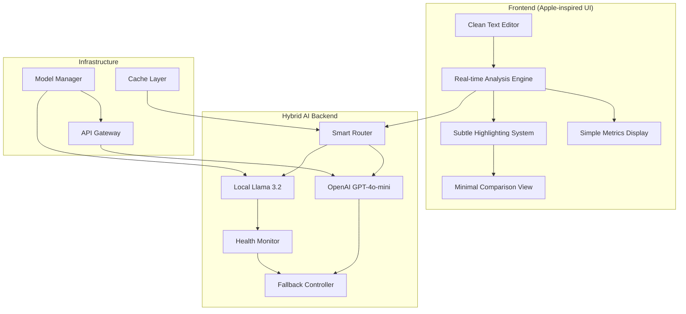

# Design Document

## Overview

The Newsletter Grading System is a clean, Apple-inspired web application that transforms newsletter content evaluation through intelligent AI analysis. The system leverages existing components from the current codebase while implementing a complete visual and architectural redesign focused on simplicity, speed, and reliability.

**Core Philosophy**: macOS-style minimalism with production-grade reliability through hybrid AI architecture.

**Key Components**:
1. **Clean Editor Interface** - Simplified version of existing RichTextEditor
2. **Hybrid AI Engine** - Local Llama 3.2 (primary) + OpenAI GPT-4o-mini (fallback)
3. **Subtle Highlighting System** - Enhanced version of existing HighlightOverlay
4. **Minimal Comparison View** - Streamlined version of existing VirtualizedDiffViewer
5. **Simple Metrics Display** - Clean scoring interface

## Architecture

### System Architecture (Hybrid AI Approach)



### Data Flow Architecture

#### Primary Flow (Local Llama 3.2)
```
User Input → Content Validation → Local Model Router → Llama 3.2 Analysis → 
Response Processing → UI Update → Subtle Highlighting
```

#### Fallback Flow (OpenAI GPT-4o-mini)
```
Local Model Failure → Fallback Trigger → OpenAI API → Response Normalization → 
UI Update → Fallback Indicator
```

#### Smart Routing Logic
```javascript
async function analyzeNewsletter(content) {
  // Try local first (faster, private)
  if (localModelHealthy && !highLoad) {
    try {
      return await llamaAnalysis(content);
    } catch (error) {
      logFallback('local-model-error', error);
    }
  }
  
  // Fallback to OpenAI (reliable, consistent)
  return await openAIAnalysis(content);
}
```

## Components and Interfaces

### Frontend Components (Leveraging Existing Code)

#### 1. Newsletter Editor (Enhanced RichTextEditor)
**Base Component**: `src/components/RichTextEditor/RichTextEditor.tsx`
**Enhancements**:
- Remove complex toolbar, keep only essential formatting
- Apply clean macOS styling
- Integrate with hybrid analysis engine
- Add keyboard shortcuts (Cmd+Enter for analysis)

```typescript
interface NewsletterEditorProps {
  content: string;
  onChange: (content: string, html: string) => void;
  onAnalyze?: () => void;
  placeholder?: string;
  className?: string;
}
```

#### 2. Subtle Highlighting System (Enhanced HighlightOverlay)
**Base Component**: `src/components/HighlightOverlay/HighlightOverlay.tsx`
**Enhancements**:
- Simplified color scheme (3 colors max)
- Smooth, non-intrusive animations
- Clean tooltip design
- Better performance optimization

```typescript
interface HighlightConfig {
  clarity: { color: '#FF6B6B', opacity: 0.3 };    // Red for clarity issues
  engagement: { color: '#FFD93D', opacity: 0.3 }; // Yellow for engagement
  tone: { color: '#6BCF7F', opacity: 0.3 };       // Green for tone issues
}
```

#### 3. Simple Metrics Display (New Component)
**Purpose**: Clean, minimal scoring interface
**Design**: Card-based layout with simple progress indicators

```typescript
interface NewsletterMetrics {
  overallGrade: 'A' | 'B' | 'C' | 'D' | 'F';
  clarity: number;      // 0-100
  engagement: number;   // 0-100
  tone: number;         // 0-100
  wordCount: number;
  readingTime: number;
}
```

#### 4. Clean Comparison View (Enhanced VirtualizedDiffViewer)
**Base Component**: `src/components/VirtualizedDiff/VirtualizedDiffViewer.tsx`
**Enhancements**:
- Minimal side-by-side layout
- Clean typography
- Subtle change indicators
- Copy functionality

### Backend Architecture (Hybrid AI System)

#### 1. Smart AI Router
**Purpose**: Intelligently route requests between local and cloud models
**Location**: `server/ai-router.ts` (new)

```typescript
interface AIRouterConfig {
  primaryModel: 'llama3.2';
  fallbackModel: 'gpt-4o-mini';
  healthCheckInterval: 30000;
  fallbackThreshold: 3; // failures before fallback
  loadBalancing: true;
}
```

#### 2. Local Model Manager (Enhanced)
**Base**: `server/model-startup.ts`
**Enhancements**:
- Llama 3.2 download and setup
- Custom newsletter analysis prompt
- Health monitoring
- Performance optimization

#### 3. OpenAI Integration (New)
**Purpose**: Reliable fallback for consistent quality
**Features**:
- GPT-4o-mini integration
- Response normalization
- Cost optimization
- Rate limiting

#### 4. Enhanced API Endpoints
**Base**: `server/index.ts`
**New Endpoints**:
```
POST /api/newsletter/analyze - Hybrid analysis
POST /api/newsletter/improve - Hybrid improvements  
GET /api/models/status - Model health check
POST /api/models/switch - Manual model switching
```

## Data Models

### Newsletter Content Model
```typescript
interface NewsletterContent {
  id: string;
  originalText: string;
  originalHTML: string;
  analyzedContent: string;     // Tagged content from AI
  metrics: NewsletterMetrics;
  improvements?: NewsletterImprovement[];
  metadata: {
    wordCount: number;
    readingTime: number;
    analysisModel: 'llama3.2' | 'gpt-4o-mini';
    analysisTime: number;
    timestamp: Date;
  };
}
```

### AI Analysis Response Model
```typescript
interface AnalysisResponse {
  taggedContent: string;       // XML-tagged problematic areas
  metrics: {
    clarity: number;
    engagement: number;
    tone: number;
    overallGrade: string;
  };
  issues: Array<{
    type: 'clarity' | 'engagement' | 'tone';
    text: string;
    suggestion: string;
    severity: 'low' | 'medium' | 'high';
    position: { start: number; end: number };
  }>;
  model: 'llama3.2' | 'gpt-4o-mini';
  processingTime: number;
}
```

### Improvement Model
```typescript
interface NewsletterImprovement {
  original: string;
  improved: string;
  type: 'clarity' | 'engagement' | 'tone';
  reasoning: string;
  confidence: number;
  position: { start: number; end: number };
}
```

## Apple-Inspired Design System

### Typography
```css
/* System fonts for native feel */
font-family: -apple-system, BlinkMacSystemFont, 'SF Pro Display', system-ui, sans-serif;

/* Typography scale */
--text-xs: 11px;    /* Captions */
--text-sm: 13px;    /* Body small */
--text-base: 15px;  /* Body */
--text-lg: 17px;    /* Subheadings */
--text-xl: 22px;    /* Headings */
--text-2xl: 28px;   /* Page titles */
```

### Color Palette (Minimal)
```css
/* Light mode (primary) */
--color-background: #ffffff;
--color-surface: #f5f5f7;
--color-border: #d2d2d7;
--color-text-primary: #1d1d1f;
--color-text-secondary: #86868b;
--color-accent: #007aff;

/* Issue colors (subtle) */
--color-clarity: #ff6b6b;
--color-engagement: #ffd93d;
--color-tone: #6bcf7f;
```

### Spacing System
```css
/* 8px base unit for consistency */
--space-1: 4px;
--space-2: 8px;
--space-3: 12px;
--space-4: 16px;
--space-6: 24px;
--space-8: 32px;
--space-12: 48px;
--space-16: 64px;
```

### Component Styling
```css
/* Clean button style */
.btn-primary {
  background: var(--color-accent);
  color: white;
  border: none;
  border-radius: 8px;
  padding: 8px 16px;
  font-weight: 500;
  transition: all 0.2s ease;
}

/* Subtle card style */
.card {
  background: var(--color-background);
  border: 1px solid var(--color-border);
  border-radius: 12px;
  padding: 24px;
  box-shadow: 0 1px 3px rgba(0, 0, 0, 0.1);
}
```

## AI Model Configuration

### Local Llama 3.2 Setup
```yaml
# Model configuration
model: llama3.2:latest
context_length: 4096
temperature: 0.3
max_tokens: 1024

# System prompt for newsletter analysis
system_prompt: |
  You are a professional newsletter editor. Analyze the provided newsletter content and identify issues in three categories:
  
  1. CLARITY: Hard to read sentences, complex words, unclear messaging
  2. ENGAGEMENT: Weak hooks, poor CTAs, boring language  
  3. TONE: Inconsistent voice, inappropriate formality, spam-like language
  
  Tag problematic text with XML tags:
  - <clarity>text</clarity> for clarity issues
  - <engagement>text</engagement> for engagement problems  
  - <tone>text</tone> for tone inconsistencies
  
  Return only the original text with appropriate tags added.
```

### OpenAI GPT-4o-mini Fallback
```typescript
const openAIConfig = {
  model: 'gpt-4o-mini',
  temperature: 0.3,
  max_tokens: 1024,
  system_prompt: `${llamaSystemPrompt}`, // Same prompt for consistency
  fallback_indicators: {
    add_header: false, // Don't indicate fallback to user
    normalize_response: true // Ensure same format as Llama
  }
};
```

## Performance Optimizations

### Frontend Optimizations
1. **Component Reuse**: Leverage existing optimized components
2. **Lazy Loading**: Load comparison view only when needed
3. **Debounced Analysis**: 1-second delay for real-time analysis
4. **Efficient Highlighting**: Use existing canvas-based overlay
5. **Memory Management**: Clean up resources properly

### Backend Optimizations
1. **Model Caching**: Keep Llama 3.2 warm in memory
2. **Response Caching**: Cache analysis results for identical content
3. **Connection Pooling**: Reuse HTTP connections
4. **Smart Routing**: Route based on model health and load
5. **Graceful Degradation**: Seamless fallback without user disruption

## Error Handling Strategy

### Local Model Failures
```typescript
// Graceful fallback without user disruption
try {
  result = await localModel.analyze(content);
} catch (error) {
  console.log('Local model unavailable, using cloud fallback');
  result = await cloudModel.analyze(content);
  // No error shown to user - seamless experience
}
```

### Network Failures
```typescript
// Retry with exponential backoff
const result = await retryWithBackoff(
  () => cloudModel.analyze(content),
  { maxRetries: 3, baseDelay: 1000 }
);
```

### User Experience During Errors
- **No Error Modals**: Errors handled silently when possible
- **Subtle Indicators**: Small status indicators for model switching
- **Graceful Degradation**: Basic functionality always available
- **Clear Recovery**: Simple retry mechanisms

## Testing Strategy

### Component Testing
- **Editor**: Test with existing RichTextEditor test suite
- **Highlighting**: Enhance existing HighlightOverlay tests
- **Metrics**: New unit tests for scoring logic
- **Comparison**: Adapt existing VirtualizedDiff tests

### AI Model Testing
- **Local Model**: Test Llama 3.2 setup and responses
- **Fallback Logic**: Test switching between models
- **Response Consistency**: Ensure both models return similar formats
- **Performance**: Load testing with concurrent requests

### Integration Testing
- **End-to-End**: Full user workflow testing
- **Cross-Browser**: Safari, Chrome, Firefox compatibility
- **Mobile**: Responsive design testing
- **Accessibility**: Screen reader and keyboard navigation

## Security Considerations

### Local Model Security
- **Sandboxing**: Run Llama 3.2 in isolated environment
- **Resource Limits**: Prevent resource exhaustion
- **Input Validation**: Sanitize all user content
- **Model Updates**: Secure update mechanism

### API Security
- **Rate Limiting**: Prevent abuse of both local and cloud APIs
- **Input Sanitization**: Clean all user input
- **API Key Management**: Secure OpenAI key storage
- **HTTPS Only**: All communications encrypted

## Deployment Architecture

### Development Environment
```yaml
# docker-compose.yml
services:
  app:
    build: .
    ports: ["3000:3000"]
    environment:
      - AI_MODE=hybrid
      - OPENAI_API_KEY=${OPENAI_API_KEY}
  
  llama:
    image: ollama/ollama
    ports: ["11434:11434"]
    volumes: ["./models:/root/.ollama"]
    command: ["serve"]
```

### Production Environment
```yaml
# Production considerations
- Load balancer for multiple app instances
- Redis for shared caching
- Monitoring for model health
- Auto-scaling based on demand
- Backup OpenAI-only mode for high load
```

## Migration Strategy

### Phase 1: Core Components
1. Simplify existing RichTextEditor
2. Enhance HighlightOverlay with new colors
3. Set up Llama 3.2 locally
4. Implement basic hybrid routing

### Phase 2: UI Redesign
1. Apply Apple-inspired styling
2. Simplify navigation and layout
3. Add clean metrics display
4. Enhance comparison view

### Phase 3: Production Hardening
1. Add comprehensive error handling
2. Implement monitoring and alerting
3. Optimize performance
4. Add comprehensive testing

### Phase 4: Polish & Launch
1. Final UI refinements
2. Documentation
3. User testing
4. Production deployment

This design leverages the existing robust codebase while transforming it into a clean, Apple-inspired newsletter grading system with production-grade hybrid AI architecture.